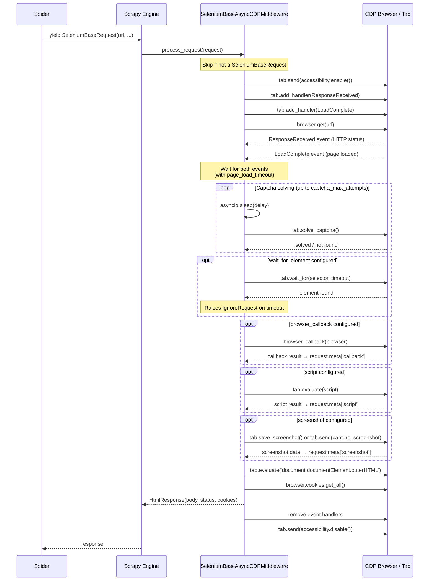

# Architecture

This document describes the internal architecture of `scrapy-seleniumbase-cdp`,
a Scrapy downloader middleware that uses SeleniumBase's pure CDP (Chrome
DevTools Protocol) mode to process requests.

## Request processing sequence

The following diagram shows what happens when the middleware processes a
`SeleniumBaseRequest`:

## Components

### `SeleniumBaseRequest` (`request.py`)

A subclass of Scrapy's `Request` that carries additional configuration for the
middleware. It accepts the following kwargs beyond the standard Scrapy ones:

- **`page_load_timeout`** — seconds to wait for both the HTTP response and page
  load events.
- **`captcha_delay`** / **`captcha_blocked_delay`** — seconds to wait before
  attempting captcha solving on successful/blocked responses.
- **`captcha_blocked_codes`** — HTTP status codes that trigger the blocked
  delay.
- **`captcha_max_attempts`** — maximum number of captcha solve attempts.
- **`wait_for_element`** / **`element_timeout`** — CSS selector and timeout for
  waiting on a specific DOM element.
- **`browser_callback`** — an async callback receiving the `Browser` instance.
- **`script`** — JavaScript code to execute on the page.
- **`screenshot`** — screenshot configuration (format, full page, save path).

The `script` argument is normalised to a `ScriptConfig` `TypedDict` via a
`match`/`case` statement. `screenshot=True` is coerced to
`{'format': 'png', 'full_page': True}`.

### `SeleniumBaseAsyncCDPMiddleware` (`middleware_async.py`)

The async Scrapy downloader middleware. It maintains a single shared `Browser`
instance for the lifetime of the spider.

#### Lifecycle

1. **`spider_opened`** — starts the CDP browser via
   `cdp_driver.start_async(**browser_options)`.
2. **`process_request`** — intercepts `SeleniumBaseRequest` instances and
   delegates to the processing pipeline (see diagram above). Regular
   `Request` objects are passed through by returning `None`.
3. **`spider_closed`** — stops the browser.

#### Event-driven page load

After calling `browser.get(url)`, the middleware awaits two `asyncio.Event`
objects — one set by the `ResponseReceived` CDP event (which captures the HTTP
status code) and one set by the `LoadComplete` accessibility event (which
signals the page has finished loading). Both are awaited together with
`asyncio.wait_for(timeout=page_load_timeout)`. If the timeout expires,
processing continues with a warning.

#### Captcha solving loop

After page load, a delay is applied based on the HTTP status code
(`captcha_delay` for 2xx, `captcha_blocked_delay` for codes in
`captcha_blocked_codes`). Then `tab.solve_captcha()` is called in a loop up to
`captcha_max_attempts` times. If the captcha is not solved within the allowed
attempts, a warning is logged and processing continues.

#### Post-load steps

After captcha handling, the middleware executes optional steps in order:

1. **Wait for element** — raises `IgnoreRequest` (after saving a debug
   screenshot) if the element is not found.
2. **Browser callback** — result stored in `response.meta['callback']`.
3. **Script execution** — result stored in `response.meta['script']`.
4. **Screenshot** — data stored in `response.meta['screenshot']` or saved to
   disk.

#### Error handling

- The `@_handle_errors` decorator wraps the callback, script, and screenshot
  methods. It catches exceptions and logs them but does **not** abort the
  request — partial results are still returned.
- An unrecoverable error in the main pipeline raises `IgnoreRequest`, causing
  Scrapy to skip the request entirely.

### CDP events

- **`ResponseReceived`** (`mycdp.network`) — fired when the browser receives an
  HTTP response. The middleware filters for `DOCUMENT`-type responses matching
  the request URL and extracts the status code.
- **`LoadComplete`** (`mycdp.accessibility`) — fired when the page has finished
  loading. The middleware filters for URLs matching the request.

### Browser & Tab (`seleniumbase.undetected.cdp_driver`)

- **`Browser`** — the top-level CDP browser instance, started once per spider.
  Provides `get(url)` for navigation, `cookies` for cookie management, and
  access to `main_tab`.
- **`Tab`** — represents a browser tab. Provides `evaluate()` for JavaScript
  execution, `wait_for()` for element waiting, `solve_captcha()` for captcha
  solving, `save_screenshot()` and `send()` for screenshot capture.
